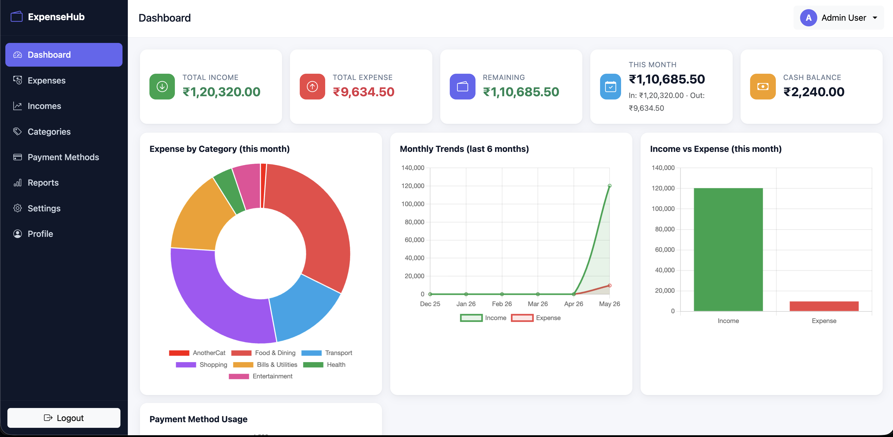
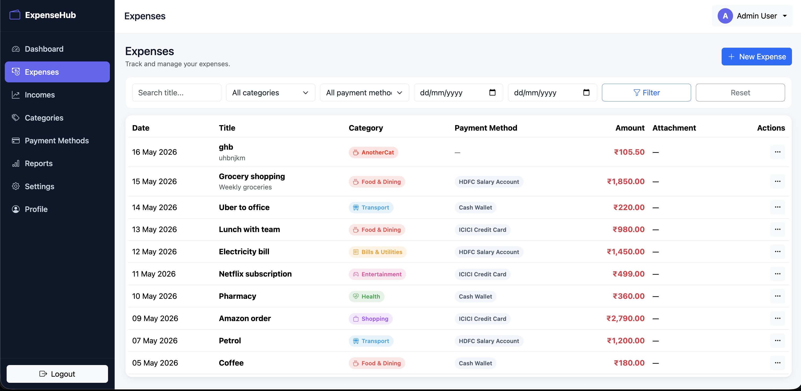
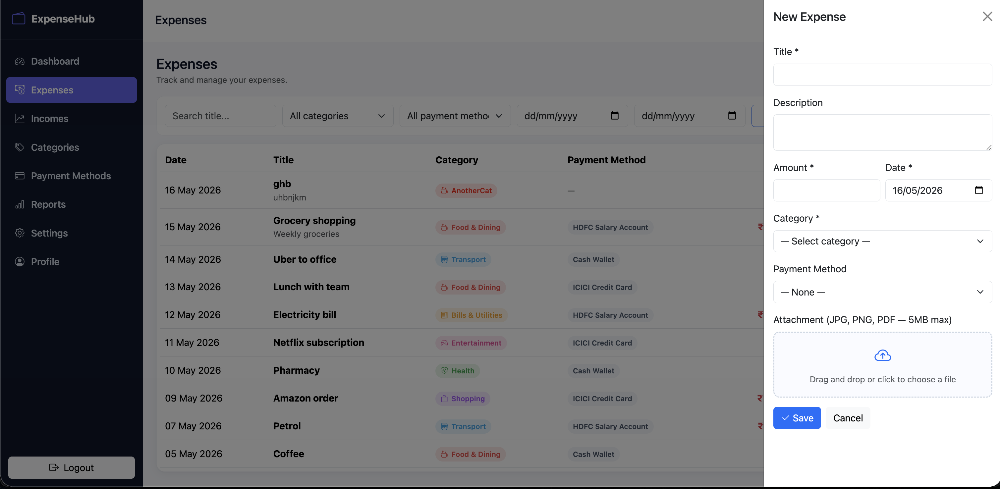
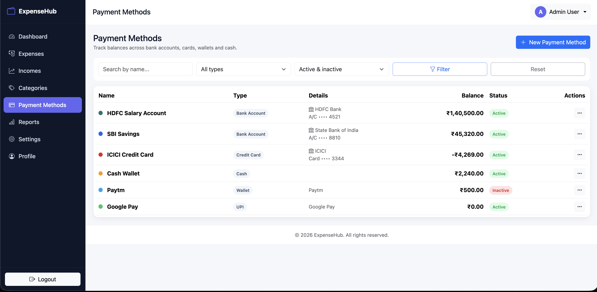
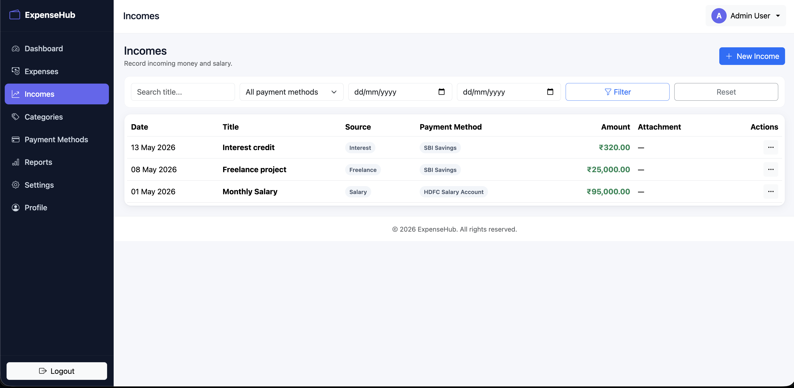

# Expense Tracker

A production-ready personal finance / expense tracker built with **Node.js + Express 5 + Sequelize + PostgreSQL + EJS + Bootstrap 5 + Chart.js**.

## Features
- Authentication: register, login, logout, session-based with bcrypt password hashing and "remember me"
- Dashboard with summary cards (total income/expense, remaining, monthly summary, cash balance, account balances) and charts (category breakdown, monthly trends, income-vs-expense, payment method usage)
- Full CRUD for Expenses, Incomes, Categories, Payment Methods
- Pagination, search, sorting, date / category / payment method filters
- File attachments for expenses and incomes (JPG/PNG/PDF, 5 MB max) with drag-and-drop upload, preview and download
- Payment method balances kept in sync via Sequelize transactions on create / update / delete
- Monthly email summary (HTML template) delivered via nodemailer + node-cron scheduler
- CSV export from the Reports page (with date filter)
- Settings (email cadence, timezone) and Profile (account info, change password)
- Responsive admin layout with collapsible sidebar, top navbar, Bootstrap offcanvas forms, toast notifications

## Tech Stack
- **Backend:** Node.js, Express 5, Sequelize 6, PostgreSQL, express-session, connect-session-sequelize, bcryptjs, multer, node-cron, nodemailer, express-validator, connect-flash, morgan, method-override, cors, dotenv, uuid
- **Frontend:** EJS + express-ejs-layouts, Bootstrap 5, Bootstrap Icons, Chart.js, vanilla JavaScript

---

## Quick Start (Docker — recommended)

The fastest way to run the project. Requires Docker Desktop (or Docker Engine + Compose plugin).

```bash
docker compose up --build
```

That single command will:

1. Build the application image
2. Start PostgreSQL 17 with persistent volume
3. Wait for the database to become healthy
4. Run all Sequelize migrations
5. Seed demo data (controlled by `SEED_ON_START=true`)
6. Start the Express app on port `3000`

Once you see `[app] Expense Tracker running at http://localhost:3000`, open your browser to:

> http://localhost:3000

Log in with the seeded demo account:

| Field    | Value                 |
|----------|-----------------------|
| Email    | `admin@example.com`   |
| Password | `password123`         |

### Docker commands cheatsheet

```bash
# Run in the background
docker compose up -d --build

# Stream logs
docker compose logs -f app

# Stop everything (keep data)
docker compose down

# Stop and wipe DB volume + uploads
docker compose down -v

# Re-run migrations / seeders inside the running container
docker compose exec app npx sequelize-cli db:migrate
docker compose exec app npx sequelize-cli db:seed:all

# Open a psql shell against the DB container
docker compose exec db psql -U expense -d expense_tracker_dev
```

To disable auto-seeding on subsequent boots, set `SEED_ON_START: "false"` in `docker-compose.yml` (the migrations still run, but seeders are skipped).

The Postgres container exposes port **5433** on the host to avoid clashing with a local Postgres on 5432.

---

## Manual Setup (without Docker)

### 1. Prerequisites
- Node.js 18+ (tested on 22)
- PostgreSQL 13+ running locally
- npm

### 2. Install dependencies
```bash
npm install
```

### 3. Configure environment
```bash
cp .env.example .env
```
Edit `.env` with your DB credentials and (optionally) SMTP credentials. Required variables:

```
PORT=3000
NODE_ENV=development

DB_HOST=localhost
DB_PORT=5432
DB_NAME=expense_tracker_dev
DB_USER=postgres
DB_USERNAME=postgres
DB_PASSWORD=postgres

SESSION_SECRET=replace-with-a-long-random-string

SMTP_HOST=
SMTP_PORT=587
SMTP_USER=
SMTP_PASSWORD=
SMTP_FROM_EMAIL=no-reply@example.com
SMTP_FROM_NAME=Expense Tracker
```

> If `SMTP_*` is blank the mailer falls back to a console-preview transport so the cron job still runs without crashing.

### 4. Create the database
```bash
createdb expense_tracker_dev
# or via psql:
psql -U postgres -c "CREATE DATABASE expense_tracker_dev;"
```

### 5. Run migrations + seeders
```bash
npm run migrate
npm run seed
```

### 6. Start the app
```bash
npm run dev      # nodemon with hot reload
# or
npm start        # plain node
```

Visit http://localhost:3000 and log in with `admin@example.com` / `password123`.

---

## NPM Scripts

| Script | Description |
|--------|-------------|
| `npm run dev` | Start with nodemon (auto-reload) |
| `npm start` | Start production-style |
| `npm run migrate` | Apply pending migrations |
| `npm run migrate:undo` | Roll back all migrations |
| `npm run seed` | Run seeders |
| `npm run seed:undo` | Roll back seeders |
| `npm run db:reset` | Undo + migrate + seed |

---

## Folder Structure

```
.
├── Dockerfile
├── docker-compose.yml
├── docker-entrypoint.sh
├── .dockerignore
├── .env / .env.example
├── .sequelizerc
├── README.md
├── server.js
├── migrations/
├── seeders/
├── models/
└── src/
    ├── app.js
    ├── config/          # Sequelize config + DB connection
    ├── controllers/     # HTTP handlers (auth, dashboard, expense, income, …)
    ├── routes/          # Route definitions per module
    ├── services/        # Business logic (transactions live here)
    ├── repositories/    # Data access via Sequelize
    ├── validators/      # express-validator rule sets
    ├── middleware/      # auth, error, locals, upload, validate
    ├── helpers/         # currency/date formatters
    ├── utils/           # pagination utilities
    ├── cron/            # node-cron schedulers
    ├── mail/            # mailer + HTML email templates
    ├── public/          # CSS, JS, image assets + uploads/
    └── views/           # EJS templates per module
```

---

## Application Modules

1. **Authentication** — register, login, logout, session middleware, flash messages
2. **Dashboard** — summary cards, four Chart.js charts, recent transactions, top spending categories, account balances
3. **Expense Management** — CRUD, attachments, filters (search/category/payment method/date), pagination, sorting
4. **Income Management** — CRUD, attachments, filters, pagination
5. **Category Management** — CRUD with color + icon, prevent deletion if used by expenses
6. **Payment Methods Management** — CRUD, types (Bank Account / Debit Card / Credit Card / Cash / Wallet / UPI / Other), active toggle, opening + current balance tracking
7. **Reports** — date-range summary, category and payment-method breakdowns, CSV export
8. **User Profile** — update name/email, change password
9. **Settings** — toggle monthly summary email, configure delivery day, email, timezone
10. **Monthly Email Reports** — node-cron daily check; emails users whose `monthly_summary_day` matches today

---

## Database Tables

All tables use **UUID primary keys** and are wired up with proper FKs / cascade rules.

- `users` (`id`, `full_name`, `email` unique, `password`, timestamps)
- `categories` (`id`, `user_id` FK, `name`, `color`, `icon`, timestamps)
- `payment_methods` (`id`, `user_id` FK, `name`, `type` enum, account/card/wallet details, balances, currency, color, icon, `is_active`, timestamps)
- `expenses` (`id`, `user_id`/`category_id`/`payment_method_id` FKs, `title`, `description`, `amount`, `expense_date`, attachment fields, timestamps)
- `incomes` (`id`, `user_id`/`payment_method_id` FKs, `title`, `description`, `amount`, `income_date`, `source`, attachment fields, timestamps)
- `user_settings` (`id`, `user_id` unique FK, monthly summary preferences, timezone, timestamps)
- `sessions` (auto-managed by connect-session-sequelize)

---

## Balance Rules

- Creating an **expense** → subtracts amount from linked payment method
- Creating an **income** → adds amount to linked payment method
- Editing reverses the old impact and applies the new one
- Deleting restores the original balance
- Editing a payment method's opening balance shifts current balance by the same delta
- All balance writes happen inside Sequelize transactions

---

## REST API (for mobile clients)

In addition to the web UI, a versioned JSON REST API is mounted at **`/api/v1`** for mobile/native apps. It uses **Bearer JWT** authentication.

### Auth
```http
POST /api/v1/auth/register     # body: { full_name, email, password } → { user, token, refreshToken }
POST /api/v1/auth/login        # body: { email, password } → { user, token, refreshToken }
POST /api/v1/auth/refresh      # body: { refresh_token } → { user, token, refreshToken } (rotated)
GET  /api/v1/auth/me           # Authorization: Bearer <token>
POST /api/v1/auth/logout
```

Tokens are split into a short-named `token` (access JWT, default 30 d) and a `refreshToken` (default 60 d). Access tokens carry `type: "access"`, refresh tokens carry `type: "refresh"` — they cannot be used interchangeably. `/auth/refresh` rotates both: clients should replace their stored pair every time. Configure via `JWT_SECRET`, `JWT_REFRESH_SECRET`, `JWT_EXPIRES_IN`, `JWT_REFRESH_EXPIRES_IN`.

### Resources (all require `Authorization: Bearer <token>`)
| Resource          | Endpoints                                                                                  |
|-------------------|--------------------------------------------------------------------------------------------|
| Categories        | `GET/POST/PUT/DELETE /api/v1/categories[/:id]`, `GET /api/v1/categories/dropdown`          |
| Payment Methods   | `GET/POST/PUT/DELETE /api/v1/payment-methods[/:id]`, `POST /api/v1/payment-methods/:id/toggle`, `GET /api/v1/payment-methods/dropdown` |
| Expenses          | `GET/POST/PUT/DELETE /api/v1/expenses[/:id]` (supports `multipart/form-data` with `attachment`) |
| Incomes           | `GET/POST/PUT/DELETE /api/v1/incomes[/:id]` (supports `multipart/form-data` with `attachment`) |
| Dashboard         | `GET /api/v1/dashboard` (full), `GET /api/v1/dashboard/summary`, `GET /api/v1/dashboard/charts/{category,trends,payment-method}` |
| Reports           | `GET /api/v1/reports`, `GET /api/v1/reports/export.csv`                                    |
| Settings          | `GET/PUT /api/v1/settings`                                                                 |
| Profile           | `GET/PUT /api/v1/profile`, `PUT /api/v1/profile/password`                                  |
| Health            | `GET /api/v1/health` (no auth)                                                             |

### Response envelope
```json
{ "ok": true, "data": { /* ... */ } }
{ "ok": false, "error": { "message": "...", "details": { "field": "..." } } }
```

### Postman
Import the collection at **`postman/expense-tracker.postman_collection.json`** — it contains every endpoint grouped by resource, an auto-saving login flow (the `Login` request stores the JWT into the `{{token}}` collection variable), and collection-level Bearer auth so child requests just work.

## Screenshots

### Dashboard
Summary cards (income, expense, remaining, this-month, cash) plus Chart.js charts for expense-by-category, monthly trends and income-vs-expense.



### Expenses
Searchable, filterable, paginated expense list with category and payment-method chips.



### New Expense (Offcanvas Form)
Right-side Bootstrap offcanvas form with drag-and-drop attachment upload.



### Payment Methods
Track balances across bank accounts, cards, wallets and cash with active/inactive status.



### Incomes
Record incoming money and salary with source and payment-method tagging.


